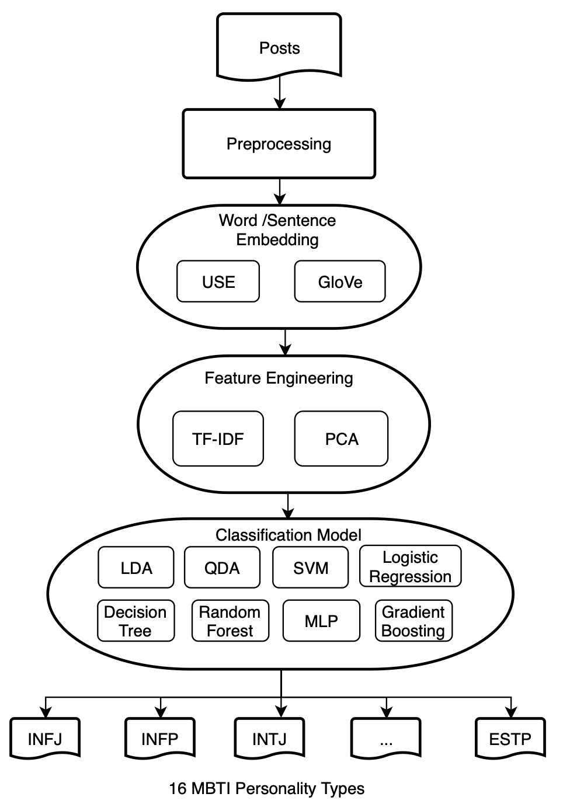
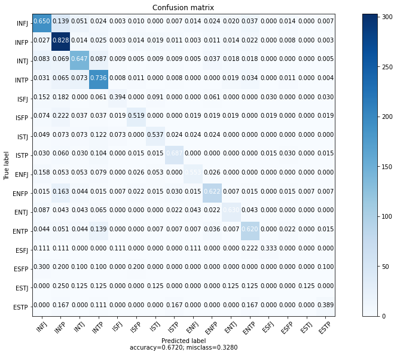

#  Myers-Briggs Personality Type Prediction with Text Classification

Semester Project of course *Introduction to Machine Learning* ([CompSci 289A](https://people.eecs.berkeley.edu/~jrs/189/)) at UC Berkeley with Prof. Jonathan Shewchuk, Spring 2022

## Documents:
- [Final Report](https://github.com/6shun/mbti-classifier/blob/main/doc/Final_Project_Report.pdf)
- [Presentation Slides](https://github.com/6shun/mbti-classifier/blob/main/doc/Final_Presentation_Slides.pdf)

**Pipeline Visualization**



**Confusion Matrix of best classifier, LDA**



## Dataset:
Kaggle dataset [(MBTI) Myers-Briggs Personality Type Dataset](https://www.kaggle.com/datasets/datasnaek/mbti-type), originally collected through PersonalityCafe forum.


## This repo is structured as following:
```
.
├── data                            
│    ├── cleaned_mbti_train.csv           # Cleaned train data
│    ├── cleaned_mbti_test.csv            # Cleaned test data
│    └── class16_mbti_map.npy           
├── docs                                 
│    ├── Final_Project_Report.pdf         # Final Project Report
│    └── Final_Presentation_Slides.pdf    # Project Presentation Slides
├── notebooks                             # Collection of notebooks
│    ├── bestmodels.ipynb                 # Best model of each classifier, final parameter
│    └── bestmodels_include_tuning.ipynb  # Best model of each classifier, tuning process
├── result                                # results: scores, cm, plot
└── README.md
```